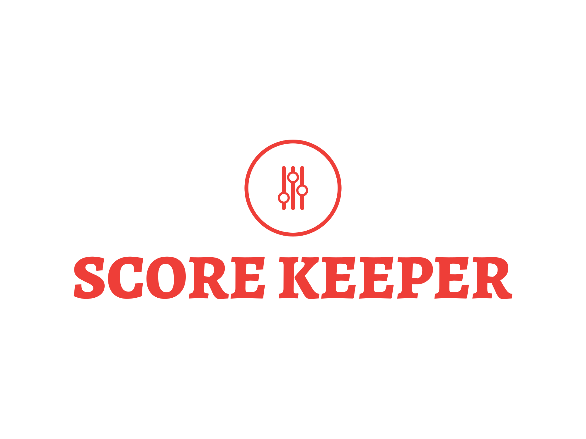
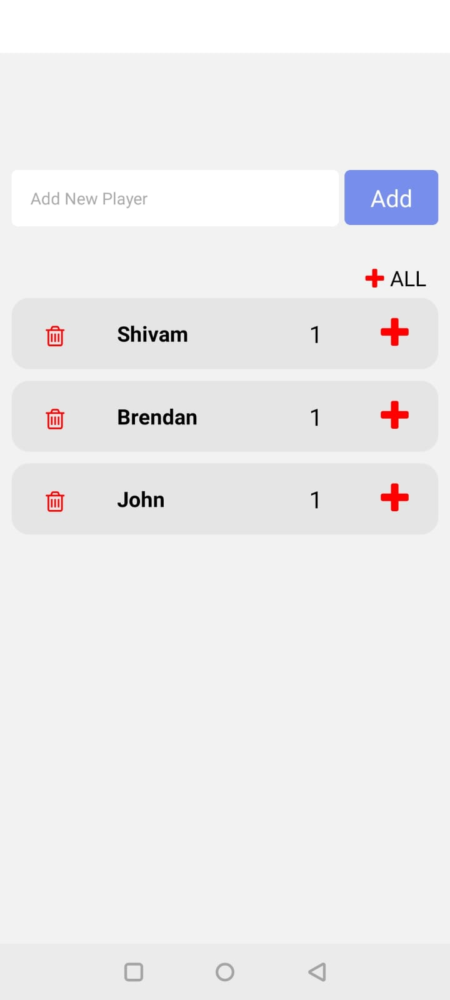
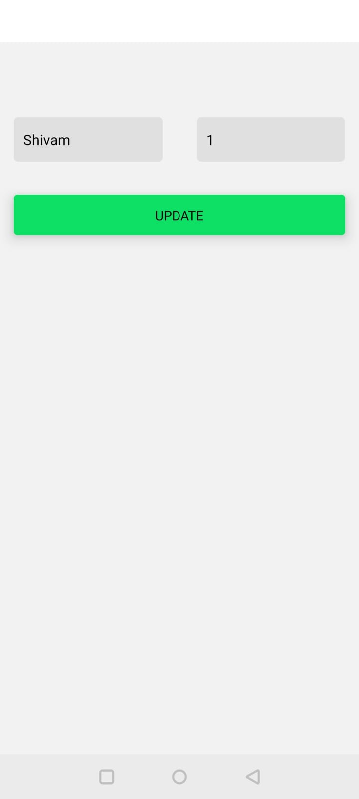

  

<h1 align="center">Score Keeper App</h1>

     <h4 align="center">
       The Score Keeper App is designed to assist users in tracking scores for games such as Mini Golf and Darts 
     </h4>
      
     

-----------------------------------------
### Overview
I developed this React Native App with the aim of simplifying scorekeeping for games like Mini Golf and Darts. It particularly shines in games where scores increase incrementally. The inspiration for this project came from a day out playing Mini Golf with friends. We found ourselves constantly jotting down each person's attempts on paper provided by the venue, which quickly became cumbersome and error-prone. This motivated me to create a user-friendly app for seamless score tracking

### Features

* User-friendly interface
* Increment score of one or all players
* Updating the name and score of any user

-----------------------------------------

### Implementation
* Built with React Native for seamless and efficient cross-platform development experience

### Screenshots

* `Home Screen`
  

 

* `Update Screen`
  

 

